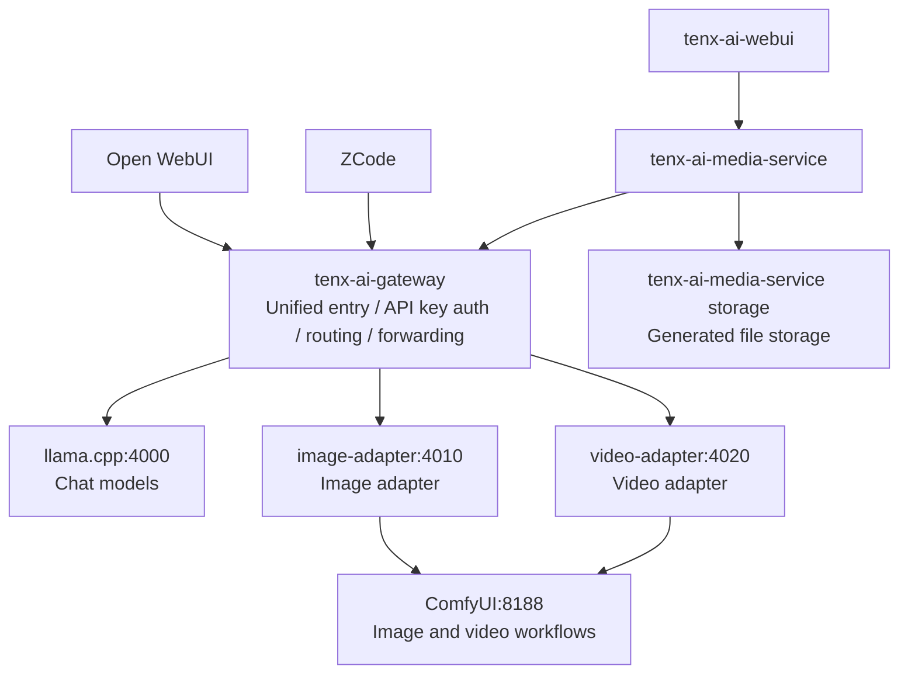

# tenx-ai-gateway

`tenx-ai-gateway` is a Java Spring Boot AI Gateway that exposes an OpenAI-compatible entry point for local and cloud models.

## Release Summary

This version focuses on model onboarding, model download guides, deployment notes, and clearer runtime boundaries for `tenx-ai-gateway`.

`tenx-ai-gateway` does not start model runtimes, manage model weights, or upload generated files. It stays at the gateway layer: unified entry point, API key authentication, model routing, request forwarding, and fallback routing.

Boundary rule:

```text
tenx-ai-gateway only routes model calls.
It does not call tenx-ai-tts-adapter.
It does not call study-ai-document-center-backend.
It does not generate final.mp4 or store media assets.
```

Runtime ownership is split by model type:

- Chat models run behind `llama.cpp` or another OpenAI-compatible text inference service.
- Image models run behind `ComfyUI` through `image-adapter`.
- Video models run behind `ComfyUI` through `video-adapter`.
- Generated image and video files are handled by `tenx-ai-media-service`, which stores them under its own local media storage and returns downloadable asset URLs for WebUI clients.

Recommended model placement:

| Model | Type | Runtime | Download mode |
| --- | --- | --- | --- |
| `qwen3-coder-next` | Chat | `llama.cpp:4000` | GGUF |
| `gpt-oss-120b` | Chat | `llama.cpp:4000` | GGUF |
| `qwen-small` | Chat | `llama.cpp:4000` | GGUF |
| `gpt-5` | Chat | Cloud OpenAI-compatible provider | No local download |
| `qwen-image` | Image | `ComfyUI:8188` through `image-adapter:4010` | ComfyUI model components |
| `flux-dev` | Image | `ComfyUI:8188` through `image-adapter:4010` | ComfyUI model components |
| `HunyuanVideo-1.5` | Video | `ComfyUI:8188` through `video-adapter:4020` | ComfyUI model components |
| `Wan2.2-TI2V-5B` | Video | `ComfyUI:8188` through `video-adapter:4020` | ComfyUI model components |

Recommended video model choices:

- `HunyuanVideo-1.5`: highest overall generation quality.
- `Wan2.2-TI2V-5B`: stable, mature, and ecosystem-friendly.

## Architecture



In this architecture, Open WebUI and ZCode call the Gateway through an OpenAI-compatible `/v1` base URL. `tenx-ai-webui` calls `tenx-ai-media-service`, and the media service calls the Gateway plus its own local media storage. The Gateway routes chat requests to `llama.cpp`, routes image requests to `image-adapter`, and routes video requests to `video-adapter`.

Speech/TTS is intentionally outside this Gateway. `video-agent` calls `tenx-ai-tts-adapter` directly for CosyVoice narration.

## Calling Chains

`tenx-ai-gateway` is only the AI model gateway. It should not call business systems such as `study-ai-document-center-backend`, and it should not store generated images, videos, or audio files.

Inbound callers:

| Caller | Calls Gateway for | Gateway endpoint |
| --- | --- | --- |
| `video-agent` | Script generation | `/v1/chat/completions` |
| `tenx-ai-media-service` | Image and video generation | `/v1/images/generations`, `/v1/videos/generations` |
| `tenx-ai-webui` or third-party clients | Direct model access when needed | `/v1/*` |
| Open WebUI / ZCode | Chat model access | `/v1/chat/completions`, `/v1/models` |

Outbound dependencies:

| Capability | Route example | Gateway forwards to | File storage owner |
| --- | --- | --- | --- |
| Chat | `qwen3-coder-next` | `TENX_LOCAL_OPENAI_BASE_URL` such as `llama.cpp:4000` | None |
| Cloud chat | `gpt-5` | `TENX_CLOUD_OPENAI_BASE_URL` | None |
| Image | `qwen-image`, `flux-dev` | `TENX_IMAGE_OPENAI_BASE_URL` such as `image-adapter:4010` | `tenx-ai-media-service` |
| Video | `Wan2.2-TI2V-5B`, `HunyuanVideo-1.5` | `TENX_VIDEO_OPENAI_BASE_URL` such as `video-adapter:4020` | `tenx-ai-media-service` |

End-to-end chains:

```text
Script:
video-agent
  -> tenx-ai-gateway /v1/chat/completions
      -> local-compatible or cloud-openai

Image:
video-agent-webui
  -> video-agent
      -> tenx-ai-media-service /api/v1/images/generations
          -> tenx-ai-gateway /v1/images/generations
              -> image-adapter
                  -> ComfyUI
          -> tenx-ai-media-service storage/media

Video:
video-agent-webui
  -> video-agent
      -> tenx-ai-media-service /api/v1/videos/generations
          -> tenx-ai-gateway /v1/videos/generations
              -> video-adapter
                  -> ComfyUI / Wan runtime
          -> tenx-ai-media-service storage/media
```

## What V1 Supports

- `POST /v1/chat/completions`
- `POST /v1/images/generations`
- `POST /v1/videos/generations`
- `GET /v1/models`
- `GET /admin/models`
- `POST /admin/models/{model}/start`
- `POST /admin/models/{model}/stop`
- `GET /healthz`
- OpenAI-compatible chat request forwarding
- OpenAI-compatible image generation forwarding
- OpenAI-compatible video generation forwarding
- Direct model names in the request, such as `qwen3-coder-next` and `gpt-oss-120b`
- Provider routing through configuration
- One-level fallback for non-streaming and streaming calls
- API Key authentication with `Authorization: Bearer <key>`
- Streaming forwarding when request body contains `"stream": true`
- Manual model runtime status, start, and stop through configured admin commands

## Runtime

- Java 8+
- Maven 3.6+
- Spring Boot 2.7.x
- Default port: `8088`

## Configuration

The default configuration is in `src/main/resources/application.yml`.

Important environment variables:

```bash
export TENX_AI_GATEWAY_API_KEYS=local-dev-key
export TENX_LOCAL_OPENAI_BASE_URL=http://127.0.0.1:4000
export TENX_LOCAL_OPENAI_API_KEY=
export TENX_IMAGE_OPENAI_BASE_URL=http://127.0.0.1:4010
export TENX_IMAGE_OPENAI_API_KEY=
export TENX_VIDEO_OPENAI_BASE_URL=http://127.0.0.1:4020
export TENX_VIDEO_OPENAI_API_KEY=
export TENX_CLOUD_OPENAI_BASE_URL=https://api.openai.com
export TENX_CLOUD_OPENAI_API_KEY=your-cloud-key
export TENX_AI_GATEWAY_ADMIN_COMMAND_TIMEOUT_MILLIS=60000
export TENX_AI_GATEWAY_ADMIN_CORS_ALLOWED_ORIGINS=http://127.0.0.1:5173,http://localhost:5173,http://macstudio.tentest.cn:5173,http://192.168.1.102:5173
```

## LAN Deployment Topology

Use these host mappings on each machine that needs to call the services:

```text
192.168.1.101  macbook.tentest.cn
192.168.1.102  macstudio.tentest.cn
192.168.1.103  windows.tentest.cn
```

Recommended placement:

| Machine | Projects | Ports |
| --- | --- | --- |
| Mac Studio | `tenx-ai-gateway-admin`, `tenx-ai-gateway`, `tenx-ai-tts-adapter` | `5173`, `8088`, `4030` |
| Windows | `tenx-ai-media-service`, `tenx-ai-webui`, `video-agent`, `video-agent-webui` | `8092`, `5175`, `8090`, `5174` |

Mac Studio service URLs:

```text
Gateway admin UI: http://macstudio.tentest.cn:5173
Gateway API:      http://macstudio.tentest.cn:8088
TTS Adapter API:  http://macstudio.tentest.cn:4030/v1
```

Windows services should call the Mac Studio Gateway and TTS Adapter by domain:

```bash
export AI_GATEWAY_BASE_URL=http://macstudio.tentest.cn:8088/v1
export AI_GATEWAY_API_KEY=local-dev-key
export TTS_ADAPTER_BASE_URL=http://macstudio.tentest.cn:4030/v1
export TTS_ADAPTER_API_KEY=local-dev-key
export TENX_AI_MEDIA_BASE_URL=http://windows.tentest.cn:8092/api/v1
export TENX_AI_MEDIA_API_KEY=local-dev-key
export TENX_AI_GATEWAY_BASE_URL=http://macstudio.tentest.cn:8088/v1
export TENX_AI_MEDIA_PUBLIC_BASE_URL=http://windows.tentest.cn:8092
```

Default model routes:

```yaml
routes:
  qwen3-coder-next:
    capability: chat
    provider: local-compatible
    model: qwen3-coder-next
    fallback-provider: cloud-openai
    fallback-model: gpt-5
  gpt-oss-120b:
    capability: chat
    provider: local-compatible
    model: gpt-oss-120b
  qwen-small:
    capability: chat
    provider: local-compatible
    model: qwen-small
  gpt-5:
    capability: chat
    provider: cloud-openai
    model: gpt-5
  qwen-image:
    capability: image
    provider: image-compatible
    model: qwen-image
  flux-dev:
    capability: image
    provider: image-compatible
    model: flux-dev
  "[HunyuanVideo-1.5]":
    capability: video
    provider: video-compatible
    model: HunyuanVideo-1.5
    default-duration-seconds: 5
    max-duration-seconds: 5
  "[Wan2.2-TI2V-5B]":
    capability: video
    provider: video-compatible
    model: Wan2.2-TI2V-5B
    default-duration-seconds: 5
    max-duration-seconds: 5
```

Any backend that exposes an OpenAI-compatible `/v1/chat/completions` endpoint can be placed behind this Gateway, including LiteLLM, vLLM, LM Studio, Ollama-compatible proxy services, or cloud providers.

For image and video generation, `tenx-ai-gateway` returns the provider response as-is. Use `tenx-ai-media-service` when a client needs generated files saved and exposed as downloadable asset URLs.

For speech generation, do not add a Gateway route. Use `video-agent -> tenx-ai-tts-adapter -> CosyVoice` so the Gateway stays independent from the TTS service.

## Admin Runtime Control

The Gateway can expose model runtime status and manually execute configured start/stop commands for each model.

Admin endpoints use the same API key authentication as `/v1`:

```bash
curl http://127.0.0.1:8088/admin/models \
  -H "Authorization: Bearer local-dev-key"
```

Start a configured model runtime:

```bash
curl -X POST http://127.0.0.1:8088/admin/models/qwen-small/start \
  -H "Authorization: Bearer local-dev-key"
```

Stop a configured model runtime:

```bash
curl -X POST http://127.0.0.1:8088/admin/models/qwen-small/stop \
  -H "Authorization: Bearer local-dev-key"
```

Runtime config example:

```yaml
tenx:
  ai:
    gateway:
      runtimes:
        qwen-small:
          health-url: http://127.0.0.1:4000/health
          start-command: /Users/lijunwei/ai-scripts/start-qwen-small.sh
          stop-command: /Users/lijunwei/ai-scripts/stop-chat-model.sh
          resource-check-command: ps -axo pid,rss,command | grep llama-server | grep -v grep || true
```

The Gateway only executes configured commands. It does not accept command text from the frontend, download model weights, or manage ComfyUI workflow internals.

Start and stop responses include command output plus status verification:

```json
{
  "model": "qwen-small",
  "action": "stop",
  "success": true,
  "statusBefore": "online",
  "statusAfter": "offline",
  "expectedStatus": "offline",
  "statusVerified": true,
  "command": {
    "success": true,
    "message": "Command executed",
    "exitCode": 0,
    "output": "llama-server stopped\n"
  },
  "resourceCheckOutput": ""
}
```

For stop operations, `success=true` means the stop command exited successfully and `health-url` became `offline`. `resource-check-command` is optional; use it to show whether model processes still exist and how much RSS memory they hold after the operation.

If the Gateway runs in Docker, these commands run inside the container. To control Mac Studio host processes, run the Gateway directly on the Mac host, or mount the scripts and model runtime paths into the container.

## Start

```bash
cd /Users/junweili1992163.com/ljwStudy/study-ai/tenx-ai-gateway
mvn spring-boot:run
```

Health check:

```bash
curl http://127.0.0.1:8088/healthz
```

## Docker Deployment

Docker Compose is the recommended long-running deployment mode for `tenx-ai-gateway`. For the current local AI architecture, deploy it on the Mac Studio or the machine closest to the model services.

Recommended placement:

```text
MacBook Pro / ZCode / Open WebUI / Java Agent
        ↓
http://Mac-Studio-IP:8088/v1
        ↓
tenx-ai-gateway
        ↓
LiteLLM / vLLM / LM Studio / Ollama-compatible proxy
        ↓
Local models
```

Build and start:

```bash
cd /Users/junweili1992163.com/ljwStudy/study-ai/tenx-ai-gateway
docker compose up -d --build
```

Check service status:

```bash
docker compose ps
docker compose logs -f tenx-ai-gateway
curl http://127.0.0.1:8088/healthz
```

Stop:

```bash
docker compose down
```

Restart after configuration changes:

```bash
docker compose up -d --build
```

Default Docker environment:

```yaml
TENX_AI_GATEWAY_API_KEYS: local-dev-key
TENX_LOCAL_OPENAI_BASE_URL: http://host.docker.internal:4000
TENX_IMAGE_OPENAI_BASE_URL: http://host.docker.internal:4010
TENX_VIDEO_OPENAI_BASE_URL: http://host.docker.internal:4020
TENX_CLOUD_OPENAI_BASE_URL: https://api.openai.com
```

Use `host.docker.internal` when the backend model service runs directly on the Mac host, outside Docker. For example, if LiteLLM, LM Studio, or another OpenAI-compatible service listens on the host at `127.0.0.1:4000`, the Gateway container should use:

```bash
TENX_LOCAL_OPENAI_BASE_URL=http://host.docker.internal:4000
```

Use a Compose service name when the backend model service is in the same `docker-compose.yml`. For example:

```bash
TENX_LOCAL_OPENAI_BASE_URL=http://litellm:4000
```

To override settings without editing `docker-compose.yml`, create a local `.env` file next to it:

```bash
TENX_AI_GATEWAY_API_KEYS=local-dev-key,github-agent-key,zcode-key
TENX_LOCAL_OPENAI_BASE_URL=http://host.docker.internal:4000
TENX_LOCAL_OPENAI_API_KEY=
TENX_IMAGE_OPENAI_BASE_URL=http://host.docker.internal:4010
TENX_IMAGE_OPENAI_API_KEY=
TENX_VIDEO_OPENAI_BASE_URL=http://host.docker.internal:4020
TENX_VIDEO_OPENAI_API_KEY=
TENX_CLOUD_OPENAI_BASE_URL=https://api.openai.com
TENX_CLOUD_OPENAI_API_KEY=
```

Do not commit `.env`. It is already ignored by `.gitignore` and `.dockerignore`.

After startup, clients should use:

```text
Base URL: http://<Gateway-IP>:8088/v1
API Key:  one value from TENX_AI_GATEWAY_API_KEYS
Model:    qwen3-coder-next or another configured real model name
```

## Install Llama.cpp

Use llama.cpp for local chat models that expose an OpenAI-compatible `/v1/chat/completions` API to the Gateway.

Recommended placement:

```text
Mac Studio
  llama.cpp:4000
  tenx-ai-gateway:8088
```

Install build tools:

```bash
xcode-select --install
brew install cmake git
```

Build llama.cpp from source:

```bash
mkdir -p /Users/lijunwei/ai
cd /Users/lijunwei/ai

git clone https://github.com/ggml-org/llama.cpp.git
cd llama.cpp

cmake -B build
cmake --build build --config Release -j
```

On macOS, llama.cpp enables Metal by default, so Apple Silicon can use GPU acceleration without an extra build flag.

Start a local OpenAI-compatible server after downloading a GGUF model:

```bash
cd /Users/lijunwei/ai/llama.cpp

./build/bin/llama-server \
  -m /Users/lijunwei/ai-models/llama-cpp/qwen-small/<model-file>.gguf \
  --host 0.0.0.0 \
  --port 4000 \
  -c 32768
```

Then point the Gateway to llama.cpp:

```bash
export TENX_LOCAL_OPENAI_BASE_URL=http://127.0.0.1:4000
```

If the Gateway runs in Docker on the same Mac host, use:

```bash
TENX_LOCAL_OPENAI_BASE_URL=http://host.docker.internal:4000
```

## Download Llama.cpp GGUF Models

Use this Python class to download GGUF models for llama.cpp through the Hugging Face Python API.

It applies to the Gateway chat models that run behind `TENX_LOCAL_OPENAI_BASE_URL`:

```text
qwen3-coder-next
gpt-oss-120b
qwen-small
```

It does not apply to `gpt-5`, because `gpt-5` is a cloud model. It also does not apply to `qwen-image`, `flux-dev`, `HunyuanVideo-1.5`, or `Wan2.2-TI2V-5B`; those image and video models should run behind ComfyUI or another diffusion/video runtime.

Install the dependency:

```bash
pip install huggingface_hub
```

Python code:

```python
from dataclasses import dataclass
from pathlib import Path
from typing import Dict, List, Optional

from huggingface_hub import snapshot_download


@dataclass(frozen=True)
class LlamaCppModelSpec:
    model_name: str
    repo_id: str
    allow_patterns: List[str]


class LlamaCppModelDownloader:
    MODEL_SPECS: Dict[str, LlamaCppModelSpec] = {
        "qwen3-coder-next": LlamaCppModelSpec(
            model_name="qwen3-coder-next",
            repo_id="Qwen/Qwen3-Coder-Next-GGUF",
            allow_patterns=[
                "*Q4_K_M*.gguf",
            ],
        ),
        "gpt-oss-120b": LlamaCppModelSpec(
            model_name="gpt-oss-120b",
            repo_id="lmstudio-community/gpt-oss-120b-GGUF",
            allow_patterns=[
                "*MXFP4*.gguf",
            ],
        ),
        "qwen-small": LlamaCppModelSpec(
            model_name="qwen-small",
            repo_id="lmstudio-community/Qwen3-8B-GGUF",
            allow_patterns=[
                "*Q4_K_M*.gguf",
            ],
        ),
    }

    def __init__(
        self,
        download_root: str,
        token: Optional[str] = None,
        revision: Optional[str] = None,
    ):
        self.download_root = Path(download_root).expanduser().resolve()
        self.token = token
        self.revision = revision

    def download(self, model_name: str) -> Path:
        if model_name not in self.MODEL_SPECS:
            supported = ", ".join(self.MODEL_SPECS.keys())
            raise ValueError(f"Unsupported model: {model_name}. Supported: {supported}")

        spec = self.MODEL_SPECS[model_name]
        target_dir = self.download_root / spec.model_name
        target_dir.mkdir(parents=True, exist_ok=True)

        local_path = snapshot_download(
            repo_id=spec.repo_id,
            repo_type="model",
            revision=self.revision,
            local_dir=str(target_dir),
            allow_patterns=spec.allow_patterns,
            token=self.token,
            local_dir_use_symlinks=False,
        )

        return Path(local_path).resolve()

    def download_all(self) -> Dict[str, Path]:
        result = {}
        for model_name in self.MODEL_SPECS:
            result[model_name] = self.download(model_name)
        return result


if __name__ == "__main__":
    import os

    downloader = LlamaCppModelDownloader(
        download_root="/Users/lijunwei/ai-models/llama-cpp",
        token=os.getenv("HF_TOKEN"),
    )

    result = downloader.download_all()

    for model_name, path in result.items():
        print(f"{model_name}: {path}")
```

Run it:

```bash
export HF_TOKEN=your_hugging_face_token
python download_llama_cpp_models.py
```

Start one downloaded GGUF model with llama.cpp:

```bash
llama-server \
  -m /Users/lijunwei/ai-models/llama-cpp/qwen-small/<model-file>.gguf \
  --host 0.0.0.0 \
  --port 4000 \
  -c 32768
```

Then point the Gateway to llama.cpp:

```bash
export TENX_LOCAL_OPENAI_BASE_URL=http://127.0.0.1:4000
```

## Install ComfyUI

Use ComfyUI for the Gateway image and video models:

```text
qwen-image
flux-dev
HunyuanVideo-1.5
Wan2.2-TI2V-5B
```

Recommended placement:

```text
Mac Studio
  ComfyUI:8188
  image-adapter:4010
  video-adapter:4020
  tenx-ai-gateway:8088
```

Install dependencies and clone ComfyUI:

```bash
mkdir -p /Users/lijunwei/ai
cd /Users/lijunwei/ai

git clone https://github.com/comfyanonymous/ComfyUI.git
cd ComfyUI

python3.11 -m venv .venv
source .venv/bin/activate

pip install --upgrade pip
pip install -r requirements.txt
pip install "huggingface_hub[cli]"
```

Start ComfyUI:

```bash
cd /Users/lijunwei/ai/ComfyUI
source .venv/bin/activate

python main.py --listen 0.0.0.0 --port 8188
```

Open ComfyUI:

```text
http://<Mac-Studio-IP>:8188
```

After downloading the image and video models, load the matching workflow template in ComfyUI and run it once manually. Then connect it to the Gateway through `image-adapter` and `video-adapter`.

Gateway environment:

```bash
export TENX_IMAGE_OPENAI_BASE_URL=http://127.0.0.1:4010
export TENX_VIDEO_OPENAI_BASE_URL=http://127.0.0.1:4020
```

If the Gateway runs in Docker on the same Mac host, use:

```bash
TENX_IMAGE_OPENAI_BASE_URL=http://host.docker.internal:4010
TENX_VIDEO_OPENAI_BASE_URL=http://host.docker.internal:4020
```

## Download ComfyUI Image And Video Models

Use this Python class to download the Gateway image and video models through the Hugging Face Python API, then install the downloaded files into a ComfyUI directory.

It applies to these Gateway models:

```text
qwen-image
flux-dev
HunyuanVideo-1.5
Wan2.2-TI2V-5B
```

Install the dependency:

```bash
pip install huggingface_hub
```

Python code:

```python
from dataclasses import dataclass
from pathlib import Path
from shutil import copy2
from typing import Dict, List, Optional

from huggingface_hub import snapshot_download


@dataclass(frozen=True)
class ComfyModelFile:
    source_path: str
    target_subdir: str


@dataclass(frozen=True)
class ComfyModelSpec:
    model_name: str
    repo_id: str
    files: List[ComfyModelFile]

    def allow_patterns(self) -> List[str]:
        return [model_file.source_path for model_file in self.files]


class ComfyModelDownloader:
    MODEL_SPECS: Dict[str, ComfyModelSpec] = {
        "qwen-image": ComfyModelSpec(
            model_name="qwen-image",
            repo_id="Comfy-Org/Qwen-Image_ComfyUI",
            files=[
                ComfyModelFile(
                    "split_files/diffusion_models/qwen_image_fp8_e4m3fn.safetensors",
                    "models/diffusion_models",
                ),
                ComfyModelFile(
                    "split_files/text_encoders/qwen_2.5_vl_7b_fp8_scaled.safetensors",
                    "models/text_encoders",
                ),
                ComfyModelFile(
                    "split_files/vae/qwen_image_vae.safetensors",
                    "models/vae",
                ),
            ],
        ),
        "flux-dev": ComfyModelSpec(
            model_name="flux-dev",
            repo_id="Comfy-Org/flux1-dev",
            files=[
                ComfyModelFile(
                    "flux1-dev-fp8.safetensors",
                    "models/checkpoints",
                ),
            ],
        ),
        "HunyuanVideo-1.5": ComfyModelSpec(
            model_name="HunyuanVideo-1.5",
            repo_id="Comfy-Org/HunyuanVideo_1.5_repackaged",
            files=[
                ComfyModelFile(
                    "split_files/text_encoders/qwen_2.5_vl_7b_fp8_scaled.safetensors",
                    "models/text_encoders",
                ),
                ComfyModelFile(
                    "split_files/text_encoders/byt5_small_glyphxl_fp16.safetensors",
                    "models/text_encoders",
                ),
                ComfyModelFile(
                    "split_files/vae/hunyuanvideo15_vae_fp16.safetensors",
                    "models/vae",
                ),
                ComfyModelFile(
                    "split_files/diffusion_models/hunyuanvideo1.5_720p_t2v_fp16.safetensors",
                    "models/diffusion_models",
                ),
            ],
        ),
        "Wan2.2-TI2V-5B": ComfyModelSpec(
            model_name="Wan2.2-TI2V-5B",
            repo_id="Comfy-Org/Wan_2.2_ComfyUI_Repackaged",
            files=[
                ComfyModelFile(
                    "split_files/diffusion_models/wan2.2_ti2v_5B_fp16.safetensors",
                    "models/diffusion_models",
                ),
                ComfyModelFile(
                    "split_files/text_encoders/umt5_xxl_fp8_e4m3fn_scaled.safetensors",
                    "models/text_encoders",
                ),
                ComfyModelFile(
                    "split_files/vae/wan2.2_vae.safetensors",
                    "models/vae",
                ),
            ],
        ),
    }

    def __init__(
        self,
        download_root: str,
        comfy_dir: str,
        token: Optional[str] = None,
        revision: Optional[str] = None,
    ):
        self.download_root = Path(download_root).expanduser().resolve()
        self.comfy_dir = Path(comfy_dir).expanduser().resolve()
        self.token = token
        self.revision = revision

    def download(self, model_name: str) -> Path:
        spec = self._get_model_spec(model_name)
        target_dir = self.download_root / spec.model_name
        target_dir.mkdir(parents=True, exist_ok=True)

        local_path = snapshot_download(
            repo_id=spec.repo_id,
            repo_type="model",
            revision=self.revision,
            local_dir=str(target_dir),
            allow_patterns=spec.allow_patterns(),
            token=self.token,
            local_dir_use_symlinks=False,
        )

        return Path(local_path).resolve()

    def install(self, model_name: str) -> Dict[str, Path]:
        spec = self._get_model_spec(model_name)
        downloaded_dir = self.download(model_name)

        installed_files = {}
        for model_file in spec.files:
            source = downloaded_dir / model_file.source_path
            target_dir = self.comfy_dir / model_file.target_subdir
            target_dir.mkdir(parents=True, exist_ok=True)

            target = target_dir / source.name
            copy2(str(source), str(target))
            installed_files[model_file.source_path] = target

        return installed_files

    def install_all(self) -> Dict[str, Dict[str, Path]]:
        result = {}
        for model_name in self.MODEL_SPECS:
            result[model_name] = self.install(model_name)
        return result

    def list_supported_models(self) -> List[str]:
        return list(self.MODEL_SPECS.keys())

    def _get_model_spec(self, model_name: str) -> ComfyModelSpec:
        spec = self.MODEL_SPECS.get(model_name)
        if spec is None:
            supported = ", ".join(self.list_supported_models())
            raise ValueError(f"Unsupported model: {model_name}. Supported: {supported}")
        return spec


if __name__ == "__main__":
    import os

    downloader = ComfyModelDownloader(
        download_root="/Users/lijunwei/ai-model-downloads",
        comfy_dir="/Users/lijunwei/ai/ComfyUI",
        token=os.getenv("HF_TOKEN"),
    )

    result = downloader.install_all()

    for model_name, files in result.items():
        print(model_name)
        for source_path, target_path in files.items():
            print(f"  {source_path} -> {target_path}")
```

Run it:

```bash
export HF_TOKEN=your_hugging_face_token
python download_comfy_models.py
```

Start ComfyUI:

```bash
cd /Users/lijunwei/ai/ComfyUI
source .venv/bin/activate
python main.py --listen 0.0.0.0 --port 8188
```

Open ComfyUI:

```text
http://<Mac-Studio-IP>:8188
```

Then load the matching workflow template for `qwen-image`, `flux-dev`, `HunyuanVideo-1.5`, or `Wan2.2-TI2V-5B`.

## Image And Video Generation

Recommended video models:

```text
HunyuanVideo-1.5  -> highest overall generation quality
Wan2.2-TI2V-5B   -> stable, mature, and ecosystem-friendly
```

Use the exact model name in the request. The Gateway does not use video aliases.

Image generation uses an OpenAI-compatible endpoint:

```text
POST /v1/images/generations
```

Example:

```bash
curl -s http://127.0.0.1:8088/v1/images/generations \
  -H 'Content-Type: application/json' \
  -H 'Authorization: Bearer local-dev-key' \
  -d '{
    "model": "qwen-image",
    "prompt": "生成一张 AI Gateway 架构图",
    "size": "1024x1024",
    "n": 1
  }'
```

The image provider can return either:

```json
{
  "data": [
    {"b64_json": "..."}
  ]
}
```

or:

```json
{
  "data": [
    {"url": "http://image-provider/result.png"}
  ]
}
```

The Gateway returns the provider response as-is. If the provider returns base64, the Gateway returns base64. If the provider returns a URL, the Gateway returns that URL:

```json
{
  "created": 1780000000,
  "data": [
    {
      "url": "http://image-provider/result.png"
    }
  ]
}
```

Video generation uses an OpenAI-compatible endpoint:

```text
POST /v1/videos/generations
```

Submit a 5-second video generation request:

```bash
curl -s http://127.0.0.1:8088/v1/videos/generations \
  -H 'Content-Type: application/json' \
  -H 'Authorization: Bearer local-dev-key' \
  -d '{
    "model": "Wan2.2-TI2V-5B",
    "prompt": "一个 5 秒的科技感视频",
    "duration": 5,
    "size": "1280x720"
  }'
```

The Gateway returns the provider response as-is:

```json
{
  "data": [
    {
      "video_url": "http://video-provider/result.mp4"
    }
  ]
}
```

Use `tenx-ai-media-service` for asynchronous WebUI video tasks, local media storage, and downloadable asset URLs.

## Use With Open WebUI Docker

When Open WebUI runs in Docker, `127.0.0.1` inside the container means the container itself, not the Mac host. Use `host.docker.internal` to let Open WebUI reach `tenx-ai-gateway` running on the host.

Start `tenx-ai-gateway` first:

```bash
cd /Users/junweili1992163.com/ljwStudy/study-ai/tenx-ai-gateway
TENX_AI_GATEWAY_API_KEYS=local-dev-key \
TENX_LOCAL_OPENAI_BASE_URL=http://127.0.0.1:4000 \
mvn spring-boot:run
```

Then start Open WebUI:

```bash
docker run -d \
  --name open-webui \
  -p 3000:8080 \
  -v open-webui:/app/backend/data \
  -e OPENAI_API_BASE_URL=http://host.docker.internal:8088/v1 \
  -e OPENAI_API_KEY=local-dev-key \
  ghcr.io/open-webui/open-webui:main
```

Open the UI:

```text
http://127.0.0.1:3000
```

Open WebUI will call these Gateway endpoints:

```text
GET  http://host.docker.internal:8088/v1/models
POST http://host.docker.internal:8088/v1/chat/completions
```

The model list should show the configured real model names:

```text
qwen3-coder-next
gpt-oss-120b
qwen-small
gpt-5
qwen-image
flux-dev
HunyuanVideo-1.5
Wan2.2-TI2V-5B
```

If Open WebUI and `tenx-ai-gateway` are on different machines, replace `host.docker.internal` with the Gateway machine's LAN IP:

```text
http://192.168.x.x:8088/v1
```

The Gateway only forwards requests. Chat will work only after the backend configured by `TENX_LOCAL_OPENAI_BASE_URL`, for example LiteLLM, vLLM, LM Studio, or another OpenAI-compatible service, is running and reachable.

## Use With ZCode

[ZCode](https://zcode.z.ai/cn) can use `tenx-ai-gateway` as a custom OpenAI-compatible provider.

Start `tenx-ai-gateway` first:

```bash
cd /Users/junweili1992163.com/ljwStudy/study-ai/tenx-ai-gateway
TENX_AI_GATEWAY_API_KEYS=local-dev-key \
TENX_LOCAL_OPENAI_BASE_URL=http://127.0.0.1:4000 \
mvn spring-boot:run
```

In ZCode, open model settings and add a custom provider:

```text
Provider name:
tenx-ai-gateway

Protocol / API format:
OpenAI Compatible / Chat Completions

Base URL:
http://127.0.0.1:8088/v1

API Key:
local-dev-key
```

Add models with the same real model names configured in `application.yml`:

```text
qwen3-coder-next
gpt-oss-120b
qwen-small
gpt-5
```

If ZCode and `tenx-ai-gateway` are on different machines, replace `127.0.0.1` with the Gateway machine's LAN IP:

```text
http://192.168.x.x:8088/v1
```

Keep the Base URL at `/v1`. Do not enter `/v1/chat/completions`, because ZCode appends the chat endpoint path by itself.

ZCode should use the chat models through `/v1/chat/completions`. Image and video endpoints are available for tools or scripts that can call custom HTTP APIs, but do not assume every ZCode mode will call them automatically.

```text
GET  /v1/models
POST /v1/chat/completions
POST /v1/images/generations
POST /v1/videos/generations
```

## Chat Example

```bash
curl -s http://127.0.0.1:8088/v1/chat/completions \
  -H 'Content-Type: application/json' \
  -H 'Authorization: Bearer local-dev-key' \
  -d '{
    "model": "qwen3-coder-next",
    "messages": [
      {"role": "system", "content": "You are a senior Java engineer."},
      {"role": "user", "content": "分析这个 Spring Boot 项目"}
    ],
    "temperature": 0.2
  }'
```

## Streaming Example

```bash
curl -N http://127.0.0.1:8088/v1/chat/completions \
  -H 'Content-Type: application/json' \
  -H 'Authorization: Bearer local-dev-key' \
  -d '{
    "model": "qwen3-coder-next",
    "stream": true,
    "messages": [
      {"role": "user", "content": "写一个 Java Controller 示例"}
    ]
  }'
```

## Test

```bash
mvn test
```

## Suggested Next Versions

V2:

- Request log table
- Token usage statistics
- Timeout and retry configuration
- Provider health check
- More explicit fallback policy

V3:

- `model=auto`
- Rate limiting
- Multi-client keys
- Cost tracking
- Dashboard

V4:

- Image generation routing
- Video generation task API
- RAG routing
- Prompt and context cache
